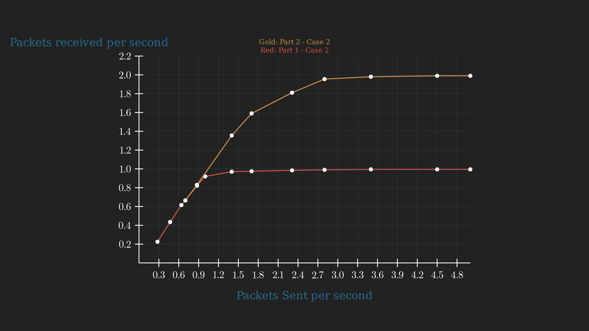

# Análisis del trafico de una red anillo bajo dos estrategias de enrutamiento

## Resumen
Los objetivos de este proyecto, ademas de reforzar los conocimientos adquiridos en el laboratorio anterior, son analizar el trafico de red bajo dos algoritmos de enrutamiento diferentes, y comparar los resultados obtenidos.

Para ello, primeramente se abordara una tarea de análisis de trafico de red, para luego implementar un algoritmo de enrutamiento mas optimo.

## Autores
- Eugenio Arcana
- Juan Ignacio Díaz
- Facundo Coria

## Introducción
***Capa de red***
- La capa de red es la tercera capa del modelo OSI  y se encarga de la transferencia de datos entre dispositivos a través de diferentes redes. Su principal función es el enrutamiento, que determina la mejor ruta para que los datos viajen desde el origen hasta el destino. Es crucial porque asegura que los paquetes de datos lleguen correctamente, manejando la dirección lógica y el control del tráfico, lo que garantiza una comunicación eficiente y confiable en redes complejas.

***Modelo de red anillo***
- Un modelo de red en anillo es una topología donde cada dispositivo está conectado a dos otros dispositivos, formando un circuito cerrado o "anillo". Los datos viajan en una dirección, pasando por cada nodo hasta alcanzar su destino.


## Metodología
- La investigación se centrará en analizar el tráfico de una red en anillo bajo dos estrategias de enrutamiento distintas, con el objetivo de comparar y evaluar los resultados obtenidos.

***Configuración de la Red Anillo:***
- Se establece una red anillo compuesta por 8 nodos, cada uno equipado con dos interfaces de comunicación y con dos posibles vecinos.
- Cada nodo cuenta con dos capas de enlace para la comunicación con sus vecinos, una capa de red y una capa de aplicación.


***Definición de Constantes y Variables:***
Se establecen las siguientes constantes y variables relevantes para la simulación, incluyendo:

1. Cada enlace tiene un tamaño de buffer de 200 paquetes.

2. Tamaño de los paquetes: 125,000 bytes.

3. La velocidad de los enlaces se establece en 1 paquete por segundo.

4. Intervalo de llegada entre paquetes: distribución exponencial con media de 1.


***Generación de Datos:***
- Utilizaremos vectores del tipo cOutVector para registrar datos específicos durante la simulación, incluyendo:
    
    1. Tamaño del buffer (calculado en cantidad de paquetes).

    2. Número saltos que dan los paquetes generados por cada nodo.

    3. Delay (diferencia de tiempo entre el envío y la recepción de paquetes).

    4. Paquetes enviados por la capa de aplicación.

    5. Paquetes recibidos por la capa de aplicación.

***Comparación de Estrategias de Enrutamiento:***

- Se llevará a cabo la simulación de la red anillo bajo las dos estrategias de enrutamiento.

- Se analizarán y compararán los resultados obtenidos.

- Se extraerán conclusiones para evaluar la efectividad del algoritmo de enrutamiento implementado y su impacto en el tráfico de la red anillo.

- Mediante esta metodología, esperamos obtener una comprensión más profunda del comportamiento del tráfico en una red en anillo y las implicaciones de diferentes estrategias de enrutamiento en su rendimiento.


## Algoritmo de enrutamiento

Para implementar el algoritmo nos basamos en la idea de escoger el camino más corto entre dos nodos. Para ello, solo asumimos que la topología de la red es un anillo.

##### Como funciona el algoritmo?

1.  Al comienzo de la simulación, cada nodo envía un paquete de reconocimiento en sentido horario con destino a si mismo, con el propósito de sondear la red y reconocer el orden de los nodos.

2.  Por defecto, se envían los paquetes en modo horario.

3.  Cada nodo cuenta con un vector en el que se guarda el identificador del nodo origen de cada paquete de reconocimiento enviado por la red que le va llegando. De esta forma, en el vector quedan ordenados los identificadores de los nodos según la posición que ocupan en la red.

4.  Una vez que el paquete llega a su destino (el mismo nodo que lo envió), consideramos que la red esta sondeada puesto que el nodo tiene en su vector todos los orígenes (o nodos) y se puede determinar que ruta es mas conveniente tomar.

5.  En este punto, comenzamos a enrutar los paquetes dependiendo de la distancia entre los nodos origen y destino.

##### Como toma la decision de que ruta elegir el algoritmo?

Una vez el vector contemple a todos los nodos, consideramos que el destino se encuentra mas cerca en sentido horario si esta en la primera mitad del vector, y en sentido antihorario si esta en la segunda mitad. Esto se puede observar en la linea que se presenta a continuación, en el método `chooseOutGate`:

```cpp
gate = (index < static_cast<int>(nodesVector.size()) / 2) ? CLOCK_WISE : COUNTER_CLOCK_WISE;
```

## Resultados
### Caso de Estudio 1
En este caso de estudio, únicamente los nodos 0 y 2 son responsables de la transmisión de datos hacia el nodo 5. La configuración de la simulación para este caso fue la siguiente:

```cpp
Network.node[{0,2}].app.interArrivalTime = exponential(1)
Network.node[{0,2}].app.destination = 5
Network.node[{0,2}].app.packetByteSize = 125000
```
A continuación, presentamos las métricas obtenidas:

1. Capacidad de los buffers en los enlaces 0 de los nodos.

2. Demora de transmisión de los paquetes a nodo destino (5).

3. Conteo de saltos de paquetes enviados por los nodos que producen tráfico hacia el nodo 5.

| Gráficos parte 1 | Gráficos parte 2|
| - | - |
||  |
||  |
|| |

- En el gráfico de capacidad de los buffers se aprecia con claridad la diferencia que tienen los dos escenarios. En el primer caso vemos que el buffer del nodo 0 es el que es escala a lo largo del tiempo debido que su interfaz es la que recibe el flujo de paquetes para dirigirse al nodo 5 por parte del nodo 2, ademas de los paquetes que el mismo produce. Por otra parte, en el caso 2 observamos los buffers mas comprometidos son los del nodo 0 (lnk 0) y nodo 2 (lnk 1) ya que son por esas interfaces por las cuales los paquetes se dirigen al nodo 5. 

Es importante destacar que en el primer caso en el buffer del nodo 2 al momento de terminar la simulación hay alrededor de 175 paquetes, mientras que en el segundo caso en los buffers se acumulan a lo sumo 10 paquetes, lo que significa que el algoritmo mejora claramente la distribución del uso de la red.

- En el gráfico de retardo en la entrega de paquetes, vemos la mejora que trae consigo el algoritmo de enrutamiento de paquetes implementado por nosotros. Por un lado, en el primer caso vemos que el retardo que tienen los paquetes en llegar al destino (nodo 5) llega hasta los 100 segundos. En otras palabras, desde el origen el paquete puede tardar 100 segundos en arribar a destino. En la otra mano, y con el algoritmo de enrutamiento que encuentra la ruta mas corta, el delay es reducido hasta los 12 segundos, indicando una mejora sustancial en cuanto a la demora del envío de los paquetes.

- Finalmente, analizando los saltos de los paquetes enviados desde el origen, vemos nuevamente una mejora en el caso del enrutamiento con nuestro algoritmo. Mientras que antes, enviar un paquete desde el nodo 2 al 5 tomaba 5 saltos, con el algoritmo de enrutamiento implementado, el paquete solo toma 3 saltos. Esto indica una mejora en la capa de red en la selección de la ruta mas corta y eficiente para el envío de paquetes.


### Caso de Estudio 2
En este escenario, todos los nodos participan en la transmisión de tráfico hacia el nodo 5. La configuración se definió de la siguiente manera:

```cpp
Network.node[{0,1,2,3,4,6,7}].app.interArrivalTime = exponential(1)
Network.node[{0,1,2,3,4,6,7}].app.destination = 5
Network.node[{0,1,2,3,4,6,7}].app.packetByteSize = 125000
```
Las métricas recolectadas para este caso fueron:

1. Capacidad de los buffers en los enlaces 0 de los nodos.

2. Demora de transmisión de los paquetes a nodo destino (5).

3. Conteo de saltos de paquetes enviados por los nodos que producen tráfico hacia el nodo 5 (o sea, todos menos si mismo).

| Gráficos parte 1 | Gráficos parte 2|
| - | - |
||  |
||  |
|| .png)| 
.png)|


- En el gráfico de la utilización de los buffers, vemos como en el primer caso se satura siempre la misma ruta ya que el enrutamiento es estático (por lo que hay un gran porcentaje de la red que queda inutilizada) y en el segundo caso se distribuye de manera mas equitativa el uso de la red debido a la selección de la ruta mas conveniente, esto ayuda a que no se saturen los buffers de los nodos y se pueda transmitir de manera mas eficiente sumado con la ganancia de tiempo que hay al escoger el camino mas corto.

- En cuanto a la demora, no vemos grandes cambios. Lo que si notamos, es que en el algoritmo de enrutamiento implementado se maximizan los valores que se encuentran en el rango de los mejores casos, esto se debe a que se están utilizando las rutas optimas para llegar al destino.

- Nuevamente, en el conteo de saltos se ve la mejora que trae consigo el algoritmo de enrutamiento implementado. Mientras que en el caso 1, algunos paquetes toman hasta 7 saltos para llegar al destino, en el caso 2, los paquetes toman a lo sumo 4 saltos, aquí se termina de comprobar que nuestro algoritmo casi mejora en un 50% la cantidad de saltos que se deben dar para llegar al destino.


#### Gráfico de Carga Útil vs Ofrecida
En el siguiente gráfico se compara el funcionamiento de la red para el caso de estudio 2. Se observa el total de paquetes enviados por segundo entre todos los nodos emisores y la cantidad de paquetes recibidos, en este caso con el único receptor, el nodo 5.



Como principal diferencia notamos para qué rangos de InterArrivalTime se consigue que la cantidad de paquetes enviados por segundo se mantenga igual a la cantidad de paquetes recibidos, lo que indica que no se encolan paquetes en los buffers ya que no hay retrasos en la red.

En la curva de la parte 1 se mantiene la estabilidad hasta alrededor de 0.9 paquetes enviados por segundo, es decir, usando un InterArrivalTime > 7.5 aproximadamente.

En cambio, para la red que hace uso del algoritmo, notamos que la estabilidad se mantiene hasta 1.4 paquetes enviados por segundo (InterArrivalTime > 5).

Es decir, la red con el algoritmo implementado consigue mantener la estabilidad para mayores valores de generación de datos por segundo.

A partir de 3 paquetes enviados por segundo entre todos los nodos emisores (equivalente a interArrivalTime ~= 2.33) se alcanza el límite de paquetes recibidos por segundo en ambos casos, y en la parte 2 se consigue duplicar a la parte 1 en cantidad de paquetes recibidos por segundo. Esto se debe a que el algoritmo consigue reducir a la mitad la cantidad de saltos promedio por paquete cuando todos los nodos envían paquetes a uno sólo.

## Conclusiones y logros

A modo de conclusion, luego de haber extraído las métricas de la red, podemos decir que el algoritmo de enrutamiento implementado ha sido exitoso. Se ha logrado disminuir la cantidad de saltos que se deben dar para llegar al destino, disminuir la congestion de la red y disminuir la demora de los paquetes o ralentizar el tiempo en el que se congestionan los buffers de los nodos.


## Discusión

Si bien el algoritmo implementado ha sido exitoso, tiene algunas limitaciones y posibles mejoras que se pueden realizar. Sabemos que se desenvuelve bien debido a que conocemos la topología de la red y podemos asumir sus propiedades, pero ante un cambio en la misma o en una red mas compleja no sabemos como se comportaría y si fuera igual de eficiente.


### Limitaciones

1. Funciona sólo para redes con topología de anillo. La implementación sólo utiliza dos interfaces para recibir y enviar paquetes, y el cálculo del camino más corto para llegar a un nodo sólo funciona en redes de este tipo.

2. El algoritmo implementado realiza el reconocimiento de la red sólo una vez, al comienzo de la simulación, por lo que no se adapta a cambios en la topología, como nodos que se agreguen o se quiten de la red.

3. No soluciona congestión de red, sólo está orientado a buscar el camino más corto hacia el nodo destino
### Posibles mejoras

- El algoritmo podría adaptarse a algunos cambios en la topología (agregado o eliminación de nodos) si se realiza periódicamente el reconocimiento de la red.
- Se podría optimizar el sondeo de la red, para comenzar antes a enviar los paquetes en la dirección correcta antes y con la utilización de menos paquetes de reconocimiento.

## Referencias

A diferencia del proyecto anterior, se ha utilizado en menor medida herramientas de Inteligencia Artificial para la realización del laboratorio como lo fue `ChatGPT`.

Por otro lado, al tener ya conocimiento previa sobre las tecnologías utilizadas, se ha podido realizar el laboratorio de manera mas eficiente y rápida.

Sin embargo, la utilización de `copilot` ha sido de gran ayuda para la realización de este laboratorio, puesto que ha permitido la generación de código de manera mas rápida y en ciertos puntos, hasta mas `clean code`.

Aunque el impacto de esta ultima herramienta nombrada, no ha sido tan significativo como en el laboratorio anterior, ya que el código que había que implementar era bastante poco en comparación al trabajo previo.
